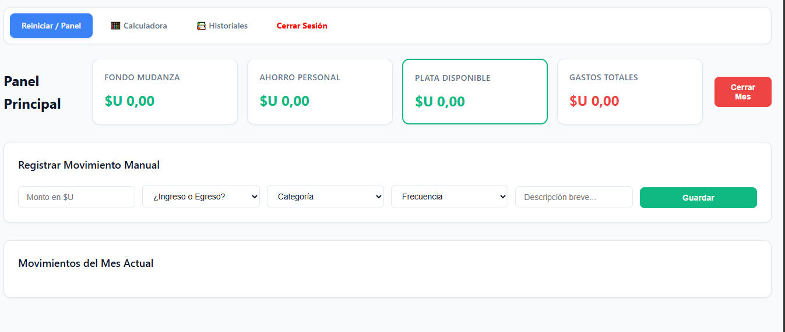

# 💰 Mi Gestor Financiero

Una aplicación web intuitiva diseñada para el control total de las finanzas personales. Permite registrar ingresos y gastos, categorizar movimientos y visualizar el historial mensual de manera clara y organizada.

---

## 🚀 Descripción del Proyecto

Este proyecto nació de la necesidad de tener un control más estricto y visual sobre el flujo de dinero personal. La aplicación permite a los usuarios:

- **Gestionar sus movimientos:** Registrar ingresos, gastos, ahorros y metas específicas (como mudanzas).
- **Visualizar el balance:** Obtener un resumen claro del estado financiero actual.
- **Historial organizado:** Consultar el desglose de meses anteriores para analizar tendencias de gasto.
- **Seguridad:** Autenticación de usuarios para proteger la privacidad de los datos financieros.

## 🛠 Tecnologías Utilizadas

Este proyecto está construido con un stack moderno y eficiente:

- **Frontend:** HTML5, CSS3 (CSS Grid/Flexbox), JavaScript (ES6+).
- **Backend:** Node.js, Express.
- **Base de Datos:** PostgreSQL.
- **Autenticación:** JSON Web Tokens (JWT).

## 📸 Vista Previa



## 📑 Manual de Usuario

He desarrollado una documentación detallada para facilitar el uso de la plataforma. Puedes consultarla aquí:
[📥 Descargar Manual de Usuario (PDF)](./Manual_de_Usuario_Mi_Gestor_Financiero.pdf)

## ⚙️ Instalación y Uso

Para ejecutar este proyecto en tu entorno local, sigue estos pasos:

1. **Clonar el repositorio:**

   ```bash
   git clone [https://github.com/tu-usuario/nombre-del-repo.git](https://github.com/tu-usuario/nombre-del-repo.git)
   cd nombre-del-repo

   ```

2. **Instalar Dependencias:**
   npm install

3. **Configuración:**
   Crea un archivo .env en la raíz basado en el archivo .env.example:

   # Ejemplo de .env

   PORT=3000
   DB_URL=tu_conexion_a_la_base_de_datos
   JWT_SECRET=tu_secreto_para_tokens

4. **Ejecutar la aplicacion:**
   npm start

📜 **Licencia**
Este proyecto está bajo la Licencia MIT. Para más detalles, consulta el archivo LICENSE.

Desarrollado como un proyecto personal para optimizar la gestión financiera.
